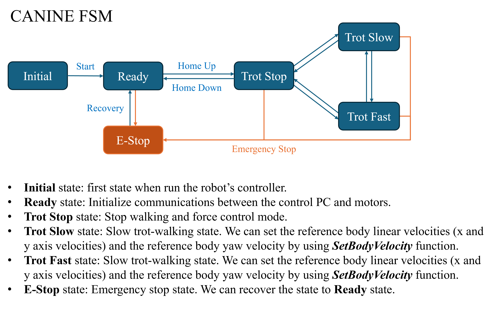

# 🐾 CANINE Middleware Project

Welcome to the Canine Middleware Project! This project is designed to help you control CANINE with ease. Below you'll find detailed instructions on how to get started, as well as useful information about the dependencies and usage.

## 📦 Dependencies

- **Eigen3**: Make sure you have Eigen3 installed to ensure proper functionality of the project.

## 🚀 How to Use

Follow these steps to get started:

1. **Match IP with the Canine**
   - Open `include/Setup.hpp`
   - Match the IP address with your canine's IP address

2. **Write Your Codes**
   - Navigate to `main.cpp`
   - Implement your control logic in the `highController` function

3. **Utilize Command Lists**
   - Check `include/CommandLists.hpp` for a list of commands to modify the Finite State Machine (FSM) of the controller
   - Refer to `description_communication.txt` for detailed information on the robot's states and command lists
     - **UDP Lists**: States from middleware to controller
     - **TCP Lists**: States from canine to middleware

## 📂 File Structure

```markdown
.
├── include
│   ├── CommandLists.hpp
│   ├── Setup.hpp
│   └── ...
├── src
│   ├── CommandLists.cpp
│   └── ...
├── description_communication.txt
└── main.cpp
```


